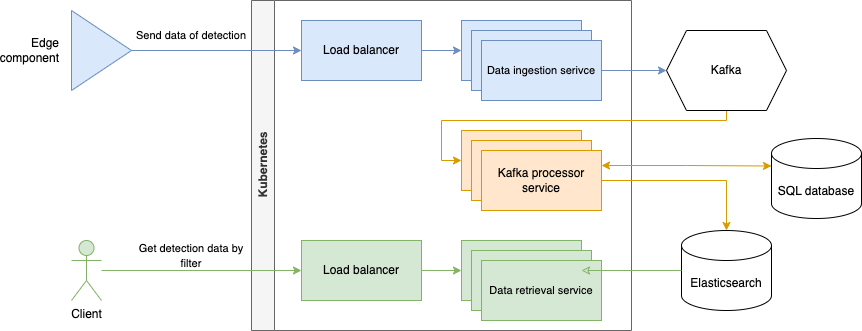

# EdgeSight

# Обзор

Этот проект представляет собой **конвейер обработки данных распознавания объектов в реальном времени**, предназначенный для обработки высокочастотных событий обнаружения с устройств граничных вычислений. Система принимает, обрабатывает, хранит и предоставляет данные обнаружения объектов, обеспечивая при этом **масштабируемость, отказоустойчивость и низкую задержку при извлечении данных**.

# Ключевые особенности

* **Прием данных с высокой частотой** – Поддерживает до **100 обнаружений каждые 100мс** с нескольких граничных устройств.
* **Масштабируемая потоковая архитектура** – Использует **Kafka** для разделенной обработки сообщений в реальном времени.
* **Оптимизированное хранение** – Хранилище **NoSQL (Elasticsearch)** для эффективного запроса и аналитики.
* **Быстрый и гибкий API** – REST API с возможностями **пагинации, фильтрации и гео-поиска**.

# Обзор системной архитектуры

## Participants

* Edge component - система, которая отправляет данные об обнаружениях в бэкенд.
* Client - клиент API для получения данных об обнаружениях по фильтрам.

## Storage components

* Kafka - потоковая передача данные об обнаружениях
* SQL database (PostgreSQL, MySQL, Oracle DB) - резервное хранилище данных об обнаружениях на случай проблем с elasticsearch
* Elasticsearch - хранилище данных об обнаружениях для гибкого запроса и аналитики. Имеет высокую скорость для получения данных и поддержку GEO запросов.

## API components

* Data ingestion serivce - сервис для получения данных об обнаружениях c Edge components для передачи данных в реальном времени на Kafka
* Kafka processor service - сервис для обработки данных об обнаружениях с Kafka и передачи данных в Elasticsearch. Для отказоустойчивости используется резервное хранилище данных SQL.
* Data retrieval service - сервис для получения данных об обнаружениях с Elasticsearch и передачи данных клиенту.

Для обеспечения высокой производительности и отказоустойчивости, используется следующая архитектура:

* Микросервисы используют горизонтальное масштабирование с использованием **Kubernetes** и load-balancer для распределения нагрузки на сервисы.
* Можно дополнительно использовать API Gateway (Spring Gateway, Nginx, F5 и т.д.) для управления доступом к API и обработки запросов.

## Взаимодействие компонентов

1. Edge component вызывают REST запрос на Data ingestion service для передачи данных об распознаваемых объектах в реальном времени.
2. Data ingestion service передает данные в Kafka.
3. Kafka processor service получает данные из Kafka с использованием batch и передает их в Elasticsearch.
   1. Если Elasticsearch не доступен, данные сохраняются в SQL database.
   2. Периодическая Job получает данные из SQL database и передает их в Elasticsearch.
   3. Если передача данных в Elasticsearch удалась, данные удаляются в SQL database.
4. Клиент вызывает REST запрос на Data retrieval service для получения данных об обнаружениях с Elasticsearch.

# Kafka processor service

Что необходимо добавить:

1. Подключить Liquibase для создания таблицы detection_failed
2. Подключить SchedLock для блокировки шедулеров между инстансами (для избежания дублирования данных)
3. Рассмотреть варианты, при которых elasticsearch и SQL база не работают одновременно. При текущей реализации мы теряем данные
4. Добавить метрики (для проверки работоспособности компонентов сервиса)
5. Добавить аллерты в удобные каналы связи (slack, teams, telegram и т.д.) при наличии проблем с elasticsearch или SQL базы
   1. Можна настроить нативно в сервисе 
   2. Можна настроить через grafana
6. Добавить тесты на функционал
7. Добавить генерацию docker image (через gradle plugin jit или dockerfile)